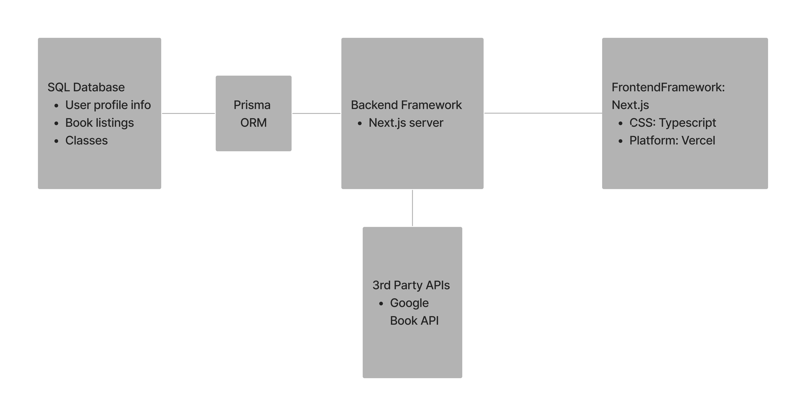

# Portfolio (2022-2023)
This is Yi Ryoung Kim's portfolio

## Book Recommendations Website 
- #### MERN Stack Project (MongoDB, Express.js, React.js, Node.js)

## Calendar 
- #### JavaScript & LAMP Stack Project (Linux, Apache HTTP Server, MySQL, PHP)
- http://ec2-18-224-15-37.us-east-2.compute.amazonaws.com/~rainmaua/calendar/calendar.php

## Movie Search Application
- #### iOS app developed in Swift

## SafetyMeter 
- #### iOS app developed in Swift and Firebase 

## News Website 
- #### LAMP Stack Project (Linux, Apache HTTP Server, MySQL, PHP)
- http://ec2-18-224-15-37.us-east-2.compute.amazonaws.com/~rainmaua/newsWebsite/news_website/main.php

## Bookstore for Univeristy Students 
- #### Next.js, TypeScript, Prisma, SQL
- 
- 

